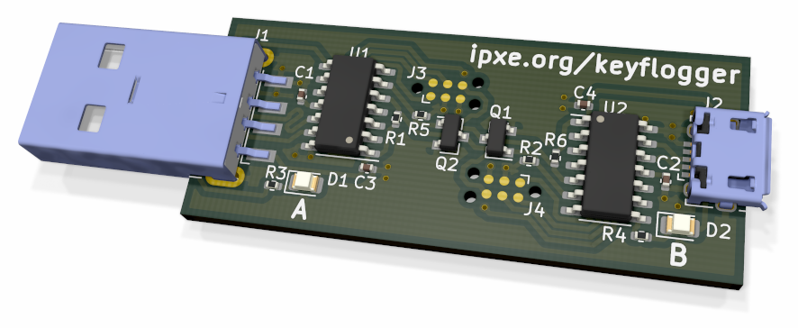

# USB keyboard/mouse injector

The `keyflogger` device allows one host computer to inject keystrokes
and mouse movements into another.  It can be used to remotely control
a computer that does not provide any software mechanism for remote
access.
